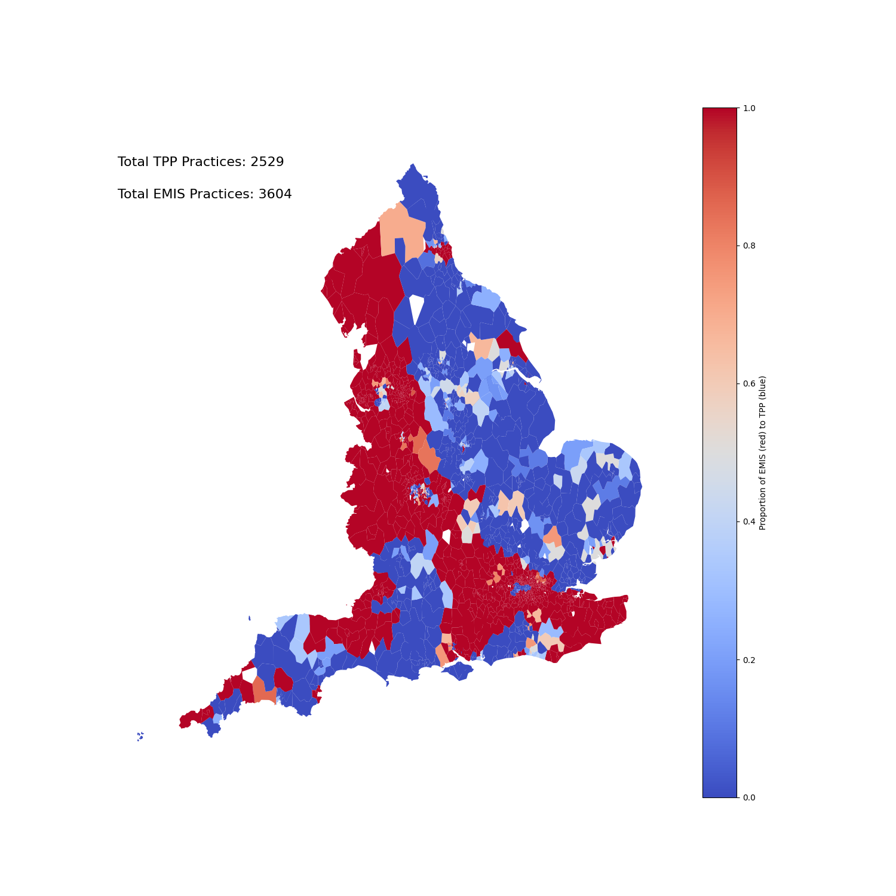

# Map of EMIS and TPP in England

EMIS and TPP are the two major GP System Suppliers to the NHS in England.

This map is updated weekly[^1]  to show their coverage at a PCN level.

[Download the data as a CSV](output/pcn_system_supplier_counts_with_icb.csv)

[^1]:  (unless there are bugs in the code, or the sources we scape have changed -- check the [action log](https://github.com/sebbacon/gpss-map/actions) to verify)